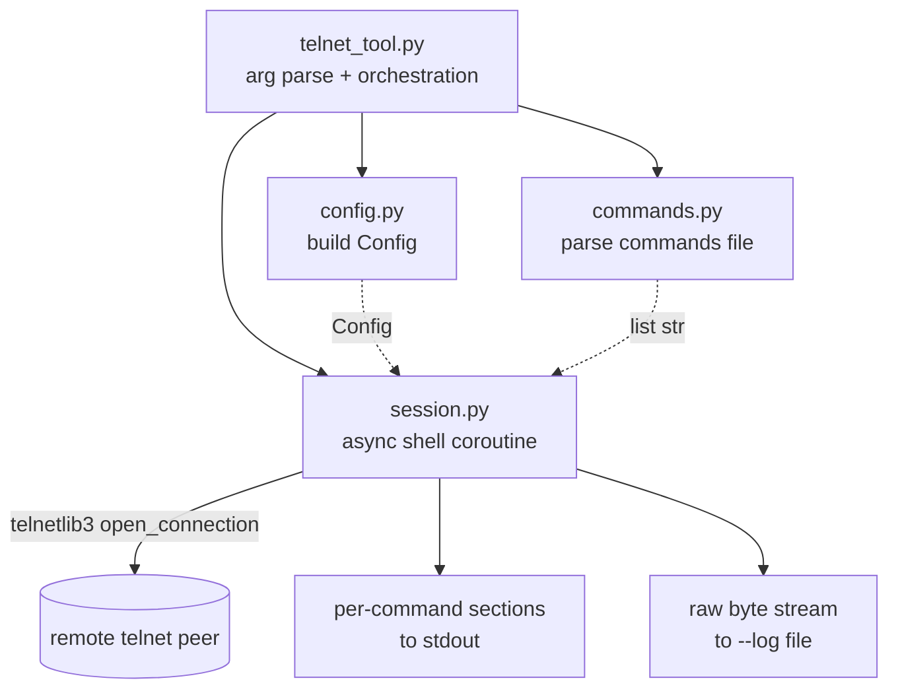
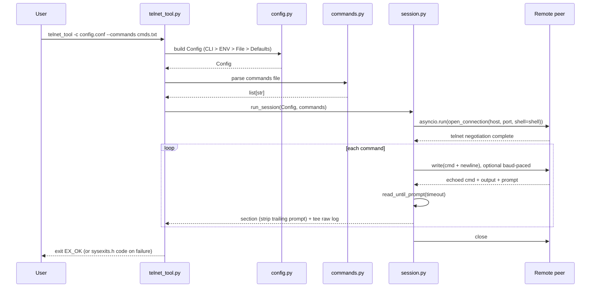

# telnet_tool Design Doc

A portable, single-dependency CLI that runs a fixed list of telnet commands
against any remote CLI emitting a recognizable prompt. The caller supplies the
prompt; the tool owns the connect / send / wait-until-prompt loop.

## Goals

- **Portable, reusable building block.** Pure-Python, cross-platform, single
  third-party dependency (`telnetlib3`). Runs on any OS with Python 3.9+.
- **Steady configuration.** Connection details and the prompt live in a config
  file; only the commands file changes between runs.
- **Predictable failure semantics.** Fail-fast on the first command whose prompt
  never reappears, with a complete raw-byte audit log for post-mortem.
- **Repo-convention fit.** Modular layout mirroring `linux-c/config-demo/`;
  `key=value` INI config with `#` / `;` comments; `CLI > ENV > File > Defaults`
  source priority; PEP 8 with type hints.

## Architecture

A thin orchestration layer over **telnetlib3's async `open_connection` + shell
coroutine model**. The shell coroutine is the heart: it receives `(reader,
writer)` and implements the send-and-wait loop directly — no threads, no
`pexpect`, no PTY. `asyncio.run()` bridges the async shell to a synchronous CLI
front-end. The shell is the *only* code that touches the network; everything
else is plain sync Python.

### Components

```
python/telnet_tool/
├── telnet_tool.py    # CLI entry: arg parsing, orchestration, exit codes
├── config.py         # Source-priority loader: CLI > ENV > File > Defaults
├── commands.py       # Commands-file parser (newline-separated, # comments)
├── session.py        # PromptMatcher + async shell coroutine + run_session()
├── Makefile          # make / make prepare / make test / make clean
├── README.md
└── tests/
    ├── test_config.py
    ├── test_commands.py
    └── test_session.py   # local socketserver-based fake telnet fixture
```

Five small modules, one job each — matches the repo's modular-demo convention.



### Work Flow



## Methods

### Configuration Keys

All keys accept `key = value` lines in the config file (`#` / `;` comments,
blank lines ignored). Sources resolve in priority order
`CLI flag > ENV var > config file > built-in default`; the leftmost source
that provides a key wins.

| Key             | Type  | Default  | CLI flag           | ENV var                     | Required |
|-----------------|-------|----------|--------------------|-----------------------------|----------|
| `host`          | str   | —        | `--host`           | `TELNET_TOOL_HOST`          | yes      |
| `port`          | int   | `23`     | `--port`           | `TELNET_TOOL_PORT`           | no       |
| `commands_file` | str   | —        | `--commands`       | `TELNET_TOOL_COMMANDS_FILE` | yes      |
| `prompt`        | str   | —        | `--prompt`         | `TELNET_TOOL_PROMPT`        | one of   |
| `prompt_regex`  | str   | —        | `--prompt-regex`   | `TELNET_TOOL_PROMPT_REGEX`   | one of   |
| `timeout`       | float | `30.0`   | `--timeout`        | `TELNET_TOOL_TIMEOUT`        | no       |
| `encoding`      | str   | `utf-8`  | `--encoding`       | `TELNET_TOOL_ENCODING`      | no       |
| `newline`       | str   | `\n`     | `--newline`        | `TELNET_TOOL_NEWLINE`       | no       |
| `baud_rate`     | int   | `0`      | `--baud-rate`      | `TELNET_TOOL_BAUD_RATE`      | no       |
| `frame_bits`    | int   | `10`     | `--frame-bits`     | `TELNET_TOOL_FRAME_BITS`     | no       |
| `command_delay` | float | `0.0`    | `--command-delay`  | `TELNET_TOOL_COMMAND_DELAY`  | no       |
| `log_path`      | str   | —        | `--log`            | `TELNET_TOOL_LOG_PATH`       | no       |
| `verbose`       | bool  | `false`  | `--verbose` / `-v` | `TELNET_TOOL_VERBOSE`        | no       |

`prompt` (literal substring, matched via `reader.readuntil`) and
`prompt_regex` (regex, matched via `reader.readuntil_pattern`) are mutually
exclusive — exactly one must be set. `baud_rate = 0` disables per-byte pacing;
`command_delay = 0.0` disables the inter-command gap; `timeout` is also used as
the TCP-connect timeout, so an unreachable host fails within `timeout`
seconds (one knob covers both connect and per-prompt waits). `verbose` emits
per-step trace lines to stderr (session start, each send, each prompt seen,
delays). Numeric knobs are range-validated at load time (`timeout > 0`,
`baud_rate >= 0`, `frame_bits > 0`, `command_delay >= 0`). `--version` and
`--help` are argparse built-ins and not config keys.

Sample config for a 9600-baud serial console:

```ini
# /etc/telnet_tool/router.conf
host          = 192.168.10.1
port          = 23
prompt        = Router#
commands_file = /etc/telnet_tool/show-cmds.txt
baud_rate     = 9600
command_delay = 0.5
log_path      = /var/log/telnet_tool/router.log
```

### Data Structures

- **`Config`** — a `@dataclass(frozen=True)` of the keys above. Built once by
  `config.py` after source-priority resolution; never mutated.
- **Commands** — a plain `list[str]`. The commands file is newline-separated
  text with `#` comments and blank lines, parsed by `commands.py` into a list
  of trimmed command strings. No per-command object.
- **`PromptMatcher`** — a small value object holding the resolved prompt: a
  literal bytes separator (passed to `reader.readuntil`) or a compiled
  `re.Pattern[bytes]` (passed to `reader.readuntil_pattern`). Exposes
  `read_until(reader, timeout, log_fp)` — dispatches to the matching native
  reader method, enforces the timeout via `asyncio.wait_for`, tees received
  bytes to `log_fp`, and raises `PromptTimeout` on a `TimeoutError` or
  `IncompleteReadError` (EOF before prompt) — and `strip_trailing(captured)`
  which removes the matched trailing prompt from the captured bytes.

### Key Process — send_and_wait loop

The shell coroutine is the entire protocol. Pseudocode:

```python
async def shell(reader, writer, *, config, commands, matcher, log_fp, out=None):
    if out is None:
        out = sys.stdout.buffer
    for cmd in commands:
        payload = (cmd + config.newline).encode(config.encoding)

        # 1. Send: when baud_rate > 0, pace each byte at the line rate
        #    (byte_delay = frame_bits / baud_rate; 8N1 frame = 10 bits).
        #    writer.drain() is backpressure (flow control), not rate limiting.
        if config.baud_rate:
            byte_delay = config.frame_bits / config.baud_rate
            for ch in payload:
                writer.write(bytes([ch]))
                await writer.drain()
                await asyncio.sleep(byte_delay)
        else:
            writer.write(payload)
            await writer.drain()
        if log_fp:
            log_fp.write(b">>> " + payload)              # tee sent bytes

        # 2. matcher.read_until: native readuntil (literal) or
        #    readuntil_pattern (regex), wrapped in asyncio.wait_for for the
        #    timeout; raises PromptTimeout on a TimeoutError or EOF-before-
        #    prompt (IncompleteReadError). Tees received bytes to log_fp.
        captured = await matcher.read_until(reader, config.timeout, log_fp)

        # 3. Strip the trailing prompt; emit the human-readable section.
        body = matcher.strip_trailing(captured)
        out.write(f"\n=== {cmd} ===\n".encode(config.encoding))
        out.write(body)
        out.flush()

        # 4. Inter-command delay for slow consoles.
        if config.command_delay:
            await asyncio.sleep(config.command_delay)

    # The shell does not own the connection lifecycle; run_session's
    # _connect_and_run closes the writer in a finally block.
```

The raw log captures both directions of the exchange: sent bytes prefixed
`>>> ` for scanability, received bytes verbatim. The stdout section is a
derived human-readable view with only the trailing prompt stripped.

**Key ideas:**

- **One read primitive, two backends.** `matcher.read_until` dispatches to
  `reader.readuntil(prompt_bytes)` for literal prompts and
  `reader.readuntil_pattern(compiled_re)` for regex prompts (telnetlib3's async
  reader methods — note: no underscore in `readuntil`). The reader methods have
  no native timeout, so `read_until` wraps the call in `asyncio.wait_for` and
  converts a `TimeoutError` or `IncompleteReadError` (EOF before prompt) into
  a raised `PromptTimeout`.
- **Binary reader/writer, direct `open_connection`.** `open_connection` is
  called with `encoding=False` so the reader/writer are bytes-based — the
  configured `encoding` controls all encode/decode, and the raw log is a true
  byte stream. The direct form (`reader, writer = await open_connection(...)`
  then `await shell(reader, writer, ...)`) is used rather than the `shell=`
  callback, which returns immediately after scheduling the shell and would
  require a separate `await writer.wait_closed()`. `connect_maxwait` bounds the
  negotiation wait against non-negotiating peers.
- **Fail-fast invariant.** A `PromptTimeout` propagates out of the shell,
  aborts the loop, and is caught by `telnet_tool.py`, which logs the offending
  command and exits with `EX_PROTOCOL`. No retry, no skip.
- **Raw log is the source of truth.** Every byte sent (prefixed `>>> `) and
  received (raw) is tee'd to `--log <path>` verbatim. The stdout sections are a
  derived, human-readable view with the trailing prompt stripped; the log is
  the audit artifact.
- **Prompt stripping is the only output transform.** The echoed command line
  and `\r\n` artifacts are kept as-is — the caller knows their device's echo
  behavior; the tool does not guess.
- **Rate limiting is in baud, the device's own unit.** telnetlib3 provides only
  `writer.drain()` (backpressure / flow control, not pacing); the tool layers
  two opt-in knobs on top. `baud_rate` (default 0 = no throttling) paces each
  byte at the device's line rate — `byte_delay = frame_bits / baud_rate`,
  where `frame_bits` defaults to 10 (the 8N1 serial frame: 1 start + 8 data +
  1 stop). `command_delay` (seconds, default 0) is the orthogonal inter-command
  gap for device processing time. Precision caveat: `asyncio.sleep` granularity
  (~1 ms on most platforms) means high-baud pacing over-throttles (safe but
  slower than the line allows); low-baud pacing — the drop-prevention case — is
  achievable since ~1 ms/byte at 9600 baud sits at the scheduler's resolution.

### Exit Codes

Failures propagate internally as Python exceptions; `telnet_tool.py`'s
top-level `main()` catches each exception type and maps it to a `sysexits.h`
code, prints a one-line message to stderr, and calls `sys.exit(code)`.
Exceptions carry rich detail for the tool's own logging; the exit code carries
the categorical result to the parent process — the only signal a shell script
or CI runner sees. argparse usage errors (unknown flag, missing value) are
intercepted by an `ArgumentParser` subclass that remaps argparse's default
exit 2 to `EX_USAGE`, so they honor the contract rather than bypassing the map.

| sysexits.h       | Code | Meaning                                    | Mapped exception                                              |
|------------------|------|--------------------------------------------|---------------------------------------------------------------|
| `EX_OK`          | 0    | All commands ran; every prompt seen       | —                                                             |
| `EX_USAGE`       | 64   | Bad CLI args / missing required config     | `MissingConfigError`; argparse usage errors (via subclass)   |
| `EX_DATAERR`     | 65   | Config parse error / invalid value         | `ConfigError` (bad value / range / encoding / regex)         |
| `EX_NOINPUT`     | 66   | Expected input file missing or unreadable  | `FileNotFoundError`, `PermissionError`, `IsADirectoryError`  |
| `EX_UNAVAILABLE` | 69   | Remote unreachable / connection refused    | `ConnectionError`, `socket.gaierror`, `socket.herror`        |
| `EX_PROTOCOL`    | 76   | Prompt not seen within `timeout`           | `PromptTimeout`                                               |
| `EX_SOFTWARE`    | 70   | Catch-all (unexpected exception)          | any other `Exception`                                         |

## Validation

- **Config priority** (`test_config.py`) — CLI flag overrides ENV overrides
  file overrides defaults; ENV prefix `TELNET_TOOL_*`; missing required keys
  (`host`, `prompt`/`prompt_regex`) raise and the CLI exits with `EX_USAGE`.
- **Commands file** (`test_commands.py`) — `#` and `;` full-line comments and
  blank lines are stripped; leading/trailing whitespace trimmed; CRLF/LF/CR
  tolerated; file-not-found exits `EX_NOINPUT`.
- **Session** (`test_session.py`):
  - *Unit tests* with a fake async reader/writer (deterministic, no network):
    happy path (stdout sections + stripped bodies; raw log tees both
    directions — sent `>>> `-prefixed, received raw), baud pacing writes
    byte-by-byte while non-baud writes the payload once per command,
    `command_delay` honored, `PromptTimeout` raised on a blocked read (with
    the offending command in the message and only sent bytes logged), regex
    prompt path via `readuntil_pattern`.
  - *Integration test*: a raw TCP echo server in a thread (no IAC; the tool's
    scenario is "caller pre-handles login" so no initial prompt is sent, and
    telnetlib3 strips any echoed IAC on the client side) exercised via the real
    `telnet_tool.py` subprocess; asserts `EX_OK`, stdout sections, and the
    `--log` content. A 20s subprocess timeout guards against negotiation hangs.

## Alternatives Considered

- **Pure stdlib socket (no deps).** Ruled out — the user chose `telnetlib3` so
  IAC option negotiation is handled correctly without reimplementing the
  telnet protocol.
- **`pexpect.spawn('telnet ...')`.** Ruled out — shells out to an external
  `telnet` binary and requires a PTY (Unix-only), breaking the cross-platform
  portability the user wants.
- **telnetlib3 sync `Telnet` shim.** Ruled out — `readuntil_pattern()` (regex
  prompt support) is only on the async reader; using the async shell unifies
  literal and regex code paths.
- **Per-command prompt override.** Ruled out — the user specified a single
  static prompt across all commands; callers needing multi-mode prompts should
  pre-handle login externally and run this tool post-login.
- **Skip-and-continue / retry on timeout.** Ruled out — the user chose fail-fast
  for safety: a missing prompt usually means the device is in an unexpected
  state, and continuing could dispatch commands to the wrong context.

## References

**Related Works**

- Python `telnetlib` (stdlib, removed in 3.13 per [PEP 594][pep594]) —
  historical reference for the sync `Telnet.read_until` API this tool's
  `PromptMatcher` echoes.
- [`pexpect`][pexpect] — pure-Python Expect; its `expect()` / `before` pattern
  inspired the per-command capture model. Not used directly because of its PTY
  and external-binary dependencies.
- In-repo [`linux-c/config-demo/`][config-demo] — established the
  `CLI > ENV > File > Defaults` source-priority pattern and INI format this
  tool mirrors.

**Key Dependencies**

- [`telnetlib3`][telnetlib3] (>=2.0.5, for `readuntil_pattern`) — the only
  third-party dependency; pure-Python, cross-platform, handles IAC negotiation.
- Python stdlib: `argparse`, `asyncio`, `re`, `dataclasses`, `pathlib`, `os`,
  `sys`, `socketserver` (tests only).

[pep594]: https://peps.python.org/pep-0594/#telnetlib
[pexpect]: https://pexpect.readthedocs.io/en/stable/
[config-demo]: ../linux-c/config-demo/README.md
[telnetlib3]: https://telnetlib3.readthedocs.io/en/latest/
